# Praktikum_Kaleb

## Lab1
Bahasa Pemograman Python 

ini adalah tampilan program lab1 

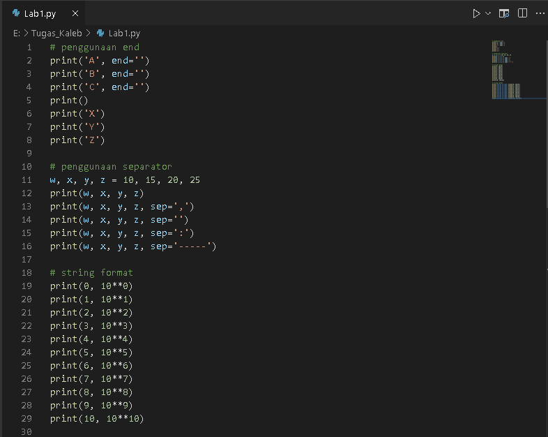
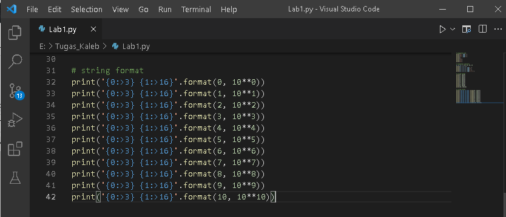

ini adalah tampilan setelah run 

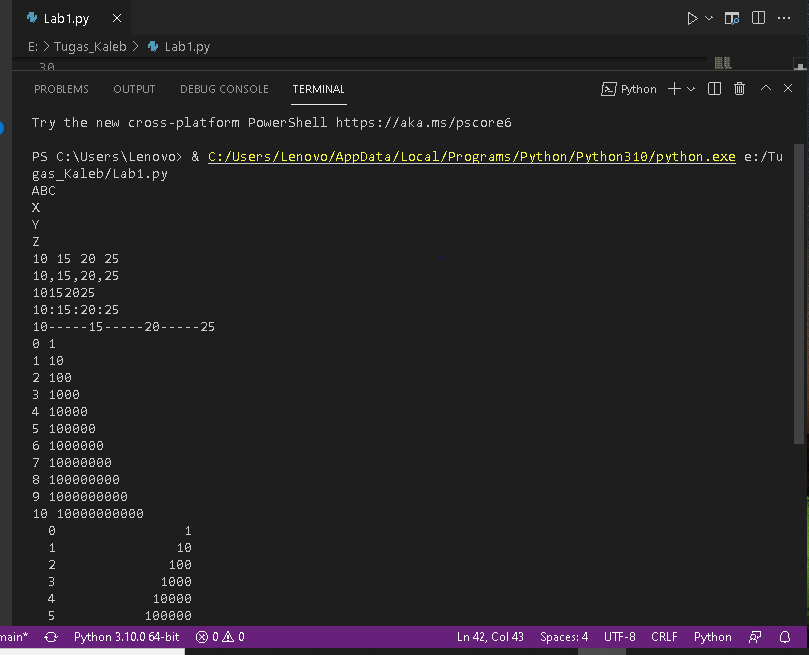

### Lab2
Konversi Nilai Variable 

Ini adalah programnya 

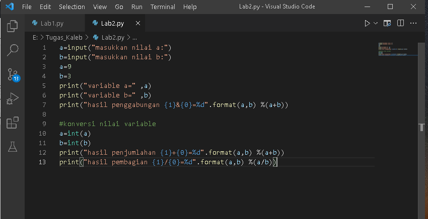

ini adalah tampilan setelah run lalu masukkan nilai a 

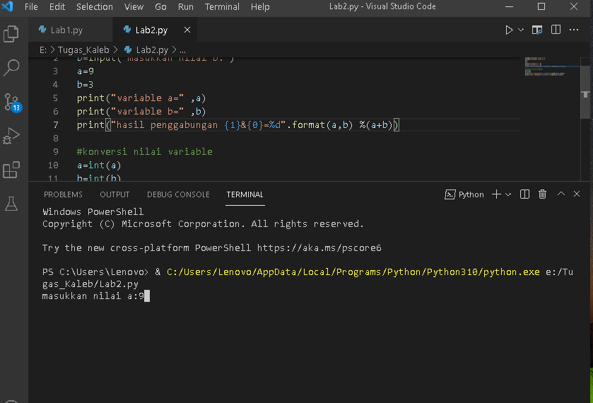
lalu masukkan nilai b 

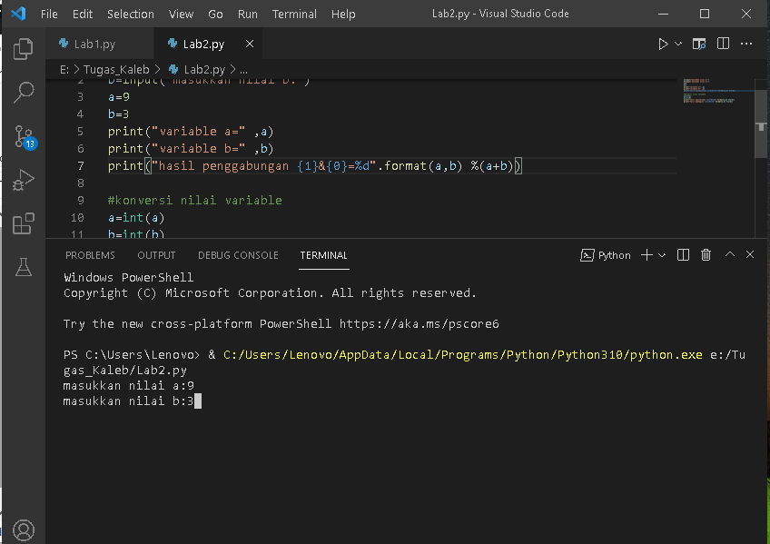
dan ini adalah hasil akhirnya 

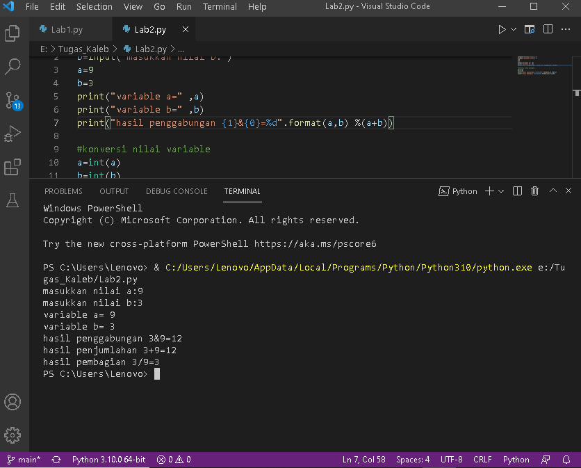

#### Flowcart
Flowcart Menghitung Luas dan Keliling Lingkaran 

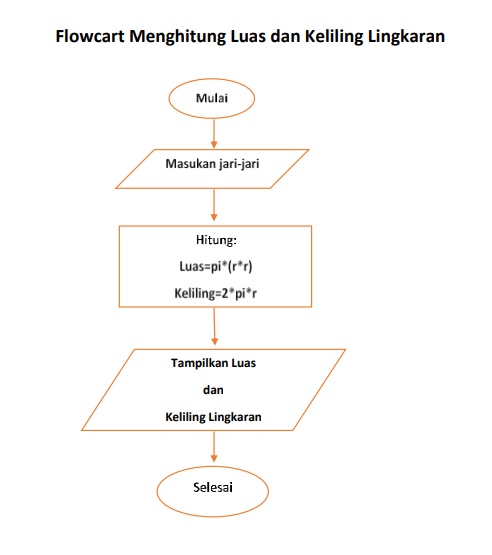

##### Luas dan Keliling Lingkaran
Rumus Luas dan Keliling Lingkaran 

Luas=pi*r*r 

Keliling = 2*pi*r 

Nilai phi yang saya gunakan adalah 3,14 

r adalah jari-jari 

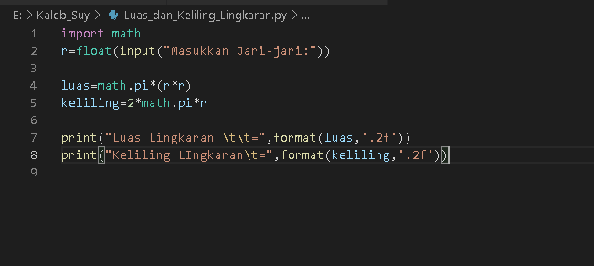

ini adalah hasil run, lalu kita masukkan nilai jari-jari lingkaran 

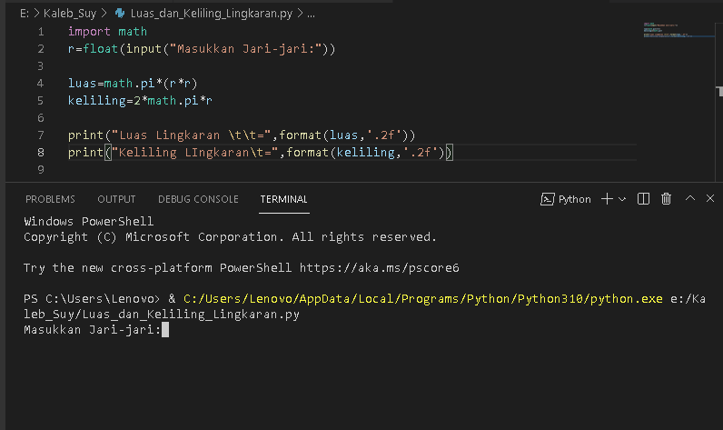

setelah masukkan nilai jari-jari maka ini adalah hasilnya 

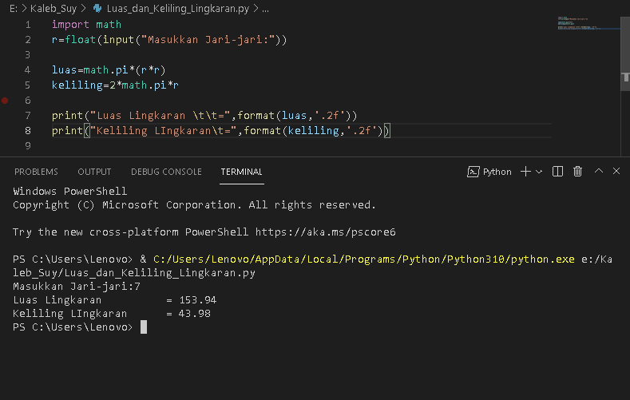

saya menggunakan fungsi input() yang nilainya dikonversi ke tipe data Float(bilangan rill) 

program diatas saya gunakan modul math yang sudah disediakan oleh python.
sintak \t merupakan karakter espace berfungsi untuk membuat tab agar karakter =(sama dengan) sejajar.
